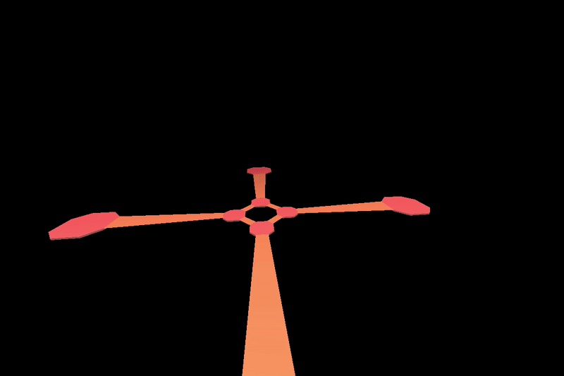

# MoonTemple
3D action puzzle game made using [PyOpenGL](http://pyopengl.sourceforge.net/), [PyGame](https://www.pygame.org/news) and my adaptations of [OBJFileLoader](https://www.pygame.org/wiki/OBJFileLoader) and [FPS Spectator](http://3dengine.org/Spectator_(PyOpenGL))

run game-main.py to play

