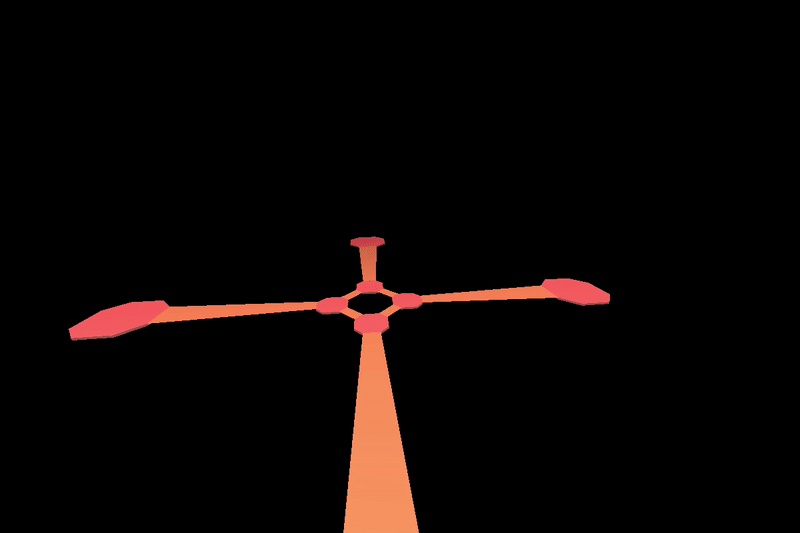

# MoonTemple
3D action puzzle game made using [PyOpenGL](http://pyopengl.sourceforge.net/), [PyGame](https://www.pygame.org/news) and my adaptations of [OBJFileLoader](https://www.pygame.org/wiki/OBJFileLoader) and [FPS Spectator](http://3dengine.org/Spectator_(PyOpenGL)). Full collision detection is in effect, including all sides of the octagonal pillars when erecting and when erected. I also programmed a physics engine that facilitates jumping as well as falling (forever) if you step off of the temple.

Moon model courtesy of [The Models Resource](https://www.models-resource.com/nintendo_64/thelegendofzeldamajorasmask/model/28863/).

## Gameplay:

